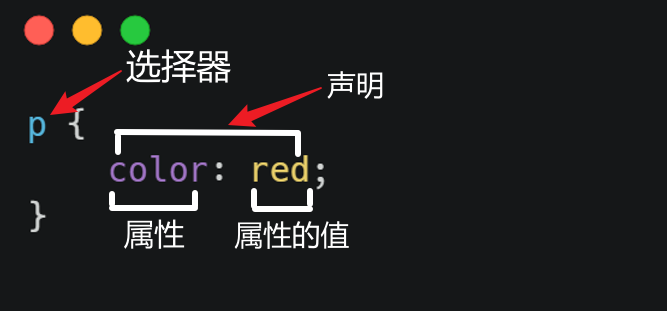

## CSS 规则集

通过 CSS （层叠样式表）可以为网页添加样式。这一节，将介绍 CSS 的格式。下面是对一段 CSS 代码的解释。

整个结构被成为**规则集**（通常简称规则）。

**选择器** (Selector)：它选择了一个或多个需要添加样式的元素，要给不同元素添加元素只需更改选择器即可。在<a href="选择器.md">选择器</a>一节，将详细介绍选择器。

**声明** (Declaration): 一个单独的规则，用来指定添加样式元素的属性。

**属性** (Properties): 改变元素样式的途径。

**属性的值** (Property value): 从指定属性的众多外观中选择一个值。

> 1. 每个规则集（除选择器部分）都应该包含在成对的大括号里（`{}`}。
> 1. 声明格式形如：`属性: 属性的值;`

